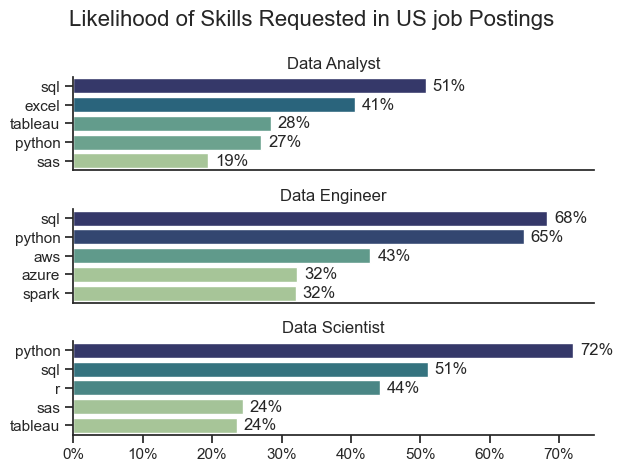
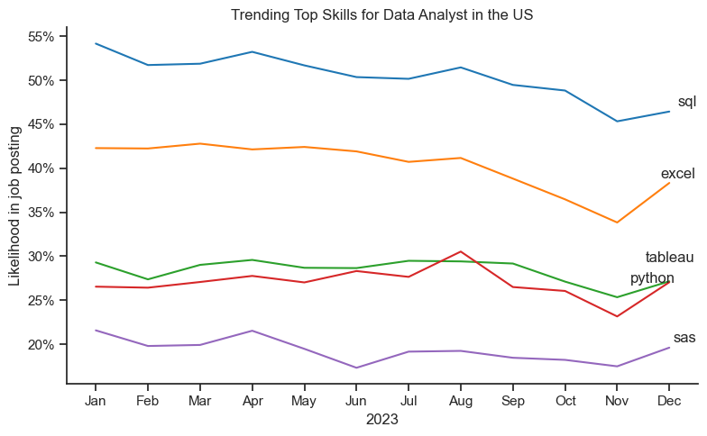
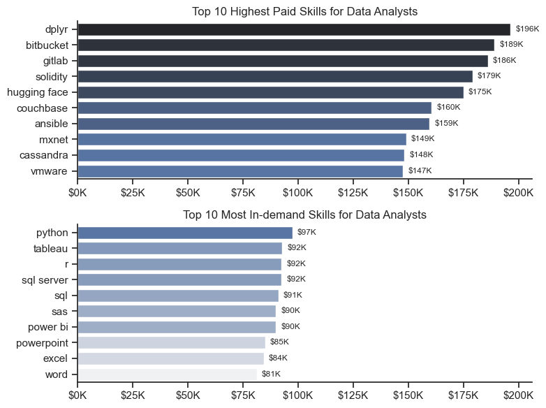
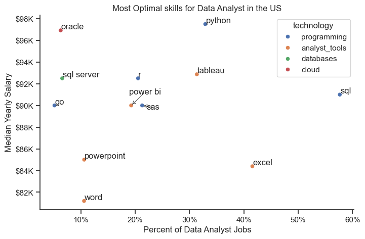
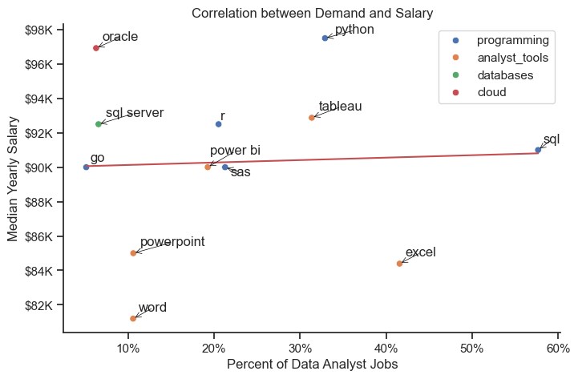

# 📊 U.S. Data Job Market Analysis

> An end-to-end exploratory data analysis of the U.S. data job market — uncovering what roles companies are hiring for, which skills they actually pay for, and what that means for anyone building a career in data.

---

## 🔍 Project Overview

This project analyzes real job postings from the U.S. data industry to answer three practical questions:

- **What roles dominate the market?**
- **Which skills are most in demand — and which ones actually pay well?**
- **Is there a relationship between how often a skill is requested and how much it pays?**

The analysis focuses on the three most common roles in the field: **Data Analyst**, **Data Scientist**, and **Data Engineer** — and digs into skill demand, salary distributions, and trends over time.

---

## 🛠️ Tools & Technologies

| Tool | Purpose |
|---|---|
| Python | Core language |
| Pandas | Data manipulation and aggregation |
| Matplotlib / Seaborn | Data visualization |
| SciPy | Statistical analysis |
| Scikit-learn (MinMaxScaler) | Normalization for correlation analysis |

---

## 📊 Skills Demand by Role

The first step was understanding what each role actually looks for. The analysis mapped the most frequently requested skills across job postings for Data Analysts, Data Scientists, and Data Engineers.



### 💡 What stood out

- **SQL is the one constant.** It appears across all three roles and consistently ranks as the most requested skill — making it the clearest baseline requirement in the field.
- **Python is the language of data science and engineering.** It shows up in over 65% of postings for those two roles, which reflects how central it's become to modeling, pipeline work, and automation.
- **Data Analysts lean on reporting tools.** Excel and Tableau dominate the Analyst skill set, which aligns with the day-to-day reality of the role: communicating insights to non-technical stakeholders.
- **Cloud and big data define Data Engineers.** AWS, Azure, and Spark appear prominently, marking the technical gap between engineering and the other roles.

---

## 📈 Skills Trends Over Time (Data Analyst)

Skill demand isn't static. Tracking how frequently each skill appeared in job postings month over month revealed some meaningful shifts.



### 💡 What stood out

- **SQL held steady throughout the year.** No major drops or spikes — just consistent, high demand. That kind of stability is a strong signal that it's a skill worth investing in regardless of timing.
- **Excel shows a gradual decline.** The drop is slow, but it's there — suggesting companies are starting to expect more than spreadsheet proficiency from their analysts.
- **Python and Tableau fluctuate.** Their demand shifts month to month, likely tied to specific project cycles and company needs rather than a clear directional trend.
- **The overall picture:** the market is moving — slowly — away from traditional tools and toward more technical skills. Not a sudden shift, but a steady one.

---

## 💰 Salary Distribution

With the skill landscape mapped out, the next question was: what does the market actually pay?


### 💡 What stood out

- **Seniority drives salary.** The jump from Data Analyst to Senior Data Analyst is visible in the data, and the progression continues upward from there.
- **Data Scientists and Engineers earn above the ~$120K median.** Both roles consistently out-earn standard Analyst positions, which reflects their higher technical requirements.
- **Salary ranges are wide.** The distributions have long tails, with outliers pushing past $300K. Company size, industry, and location are likely the main drivers of that variance.
- **Data Analyst is a strong entry point.** Median compensation around ~$90K is competitive, especially for a role that doesn't require as deep a technical background as the other two.

---

## 🏆 Highest Paid vs. Most In-Demand Skills (Data Analyst)

Not all high-value skills are the ones everyone talks about. Breaking down the top 10 by salary versus top 10 by demand reveals a real disconnect.



### 💡 What stood out

- **The highest-paid skills are niche.** dplyr ($196K), Bitbucket ($189K), GitLab ($186K), Solidity ($179K), and Hugging Face ($175K) are all specialized — tied to version control, blockchain development, and ML/AI tooling. These aren't skills most job postings ask for, but when they do, they pay significantly more.
- **The most in-demand skills cluster in the $81K–$97K range.** Python, Tableau, R, SQL Server, and SQL are what companies most commonly look for — but that widespread demand also keeps salaries more compressed.
- **To test this formally**, a MinMaxScaler normalization was applied to both salary and demand frequency, followed by a Pearson correlation (`.corr()`). **The result: no significant correlation.** Being widely requested does not translate into higher pay for Data Analysts.

---

## 🎯 Most Optimal Skills for Data Analysts in the U.S.

Combining demand frequency with median salary in a single view makes it easier to identify which skills offer the best trade-off between job availability and earning potential.



### 💡 What stood out

- **Python is the closest thing to an ideal skill.** Strong demand (~33% of postings) combined with a ~$98K median salary makes it the most well-rounded option for analysts looking to grow.
- **SQL is everywhere.** At nearly 60% of job postings, it's the most requested skill by a significant margin. Salary is competitive at ~$91K, though slightly below Python.
- **Oracle is a hidden gem.** It appears in fewer than 5% of postings but offers the highest median salary among cloud/database tools at ~$97K — low competition, high reward.
- **BI tools sit in the middle.** Tableau, Power BI, and SAS offer a reasonable balance, landing in the $90K–$93K range with moderate demand.
- **Office tools drag salaries down.** PowerPoint, Excel, and Word are moderately requested but anchor the lower end of the salary scale ($81K–$85K). Relying on them alone doesn't build leverage.

---

## 📉 Demand vs. Salary: Is There a Correlation?

The final piece was putting the demand-salary relationship to a visual test.
``` Python
# Normalizing demand frequency and median salary to test correlation
from sklearn.preprocessing import MinMaxScaler

scaler = MinMaxScaler()
df_normalized = df_plot[['median_salary', 'skill_count']].copy()
df_normalized[['median_salary', 'skill_count']] = scaler.fit_transform(
    df_normalized[['median_salary', 'skill_count']]
)

df_normalized['median_salary'].corr(df_normalized['skill_count'])
# Output: 0.047 → close to zero, indicating no meaningful linear relationship
```



### 💡 What stood out

- **The trendline is nearly flat.** The regression line across all skills has a slope close to zero, which visually confirms what the correlation analysis showed numerically: **demand frequency and salary are largely independent variables** in the Data Analyst market.
- **The outliers tell the real story.** Word and Excel are moderately demanded but among the lowest paid. Oracle is rarely requested but among the highest paid. These extremes illustrate why demand alone is a poor proxy for value.
- **The practical takeaway:** chasing in-demand skills isn't the same as chasing well-paid ones. The most strategic path is targeting skills like Python and SQL that happen to offer both — rather than assuming that what's common is also what's valuable.

---

## 💼 Who This Is Useful For

- **Job seekers** deciding where to focus their learning — the data here suggests 
  Python + SQL as the clearest high-demand, high-pay combination.
- **Hiring managers** benchmarking salaries: niche skills (GitLab, dplyr, 
  Hugging Face) command $150K+, while common tools cluster near $90K.
- **Anyone skeptical of "learn what's trending" advice** — this analysis shows 
  demand rank and pay rank are nearly uncorrelated (r = 0.047).

---

## 📌 Conclusion

The U.S. data job market rewards specialization — but not in the way most people expect. The skills that appear most often in job postings aren't necessarily the ones that pay the most. There's no meaningful correlation between demand and salary for Data Analysts, which means that building a strong career in this field requires a more deliberate approach: understanding not just what companies ask for, but what they're actually willing to pay for.

The clearest wins are Python and SQL — skills that appear frequently *and* pay well. From there, targeted investment in niche tools (version control, ML frameworks, cloud databases) opens the door to significantly higher compensation, even if those roles are harder to find.

---

*Analysis based on U.S. job postings data. All salary figures represent median annual compensation.*
